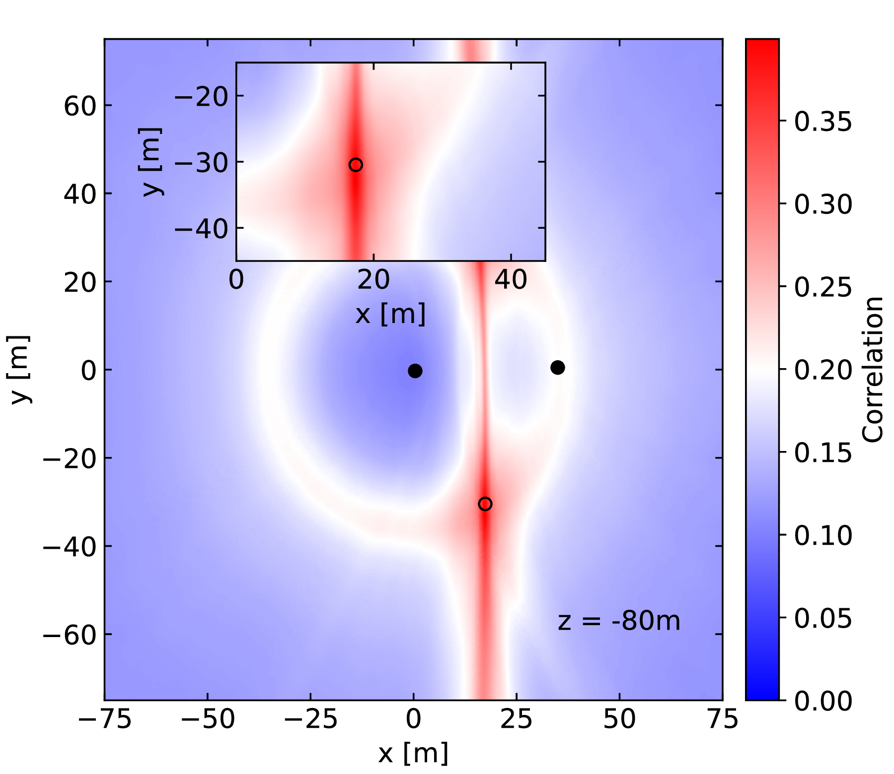
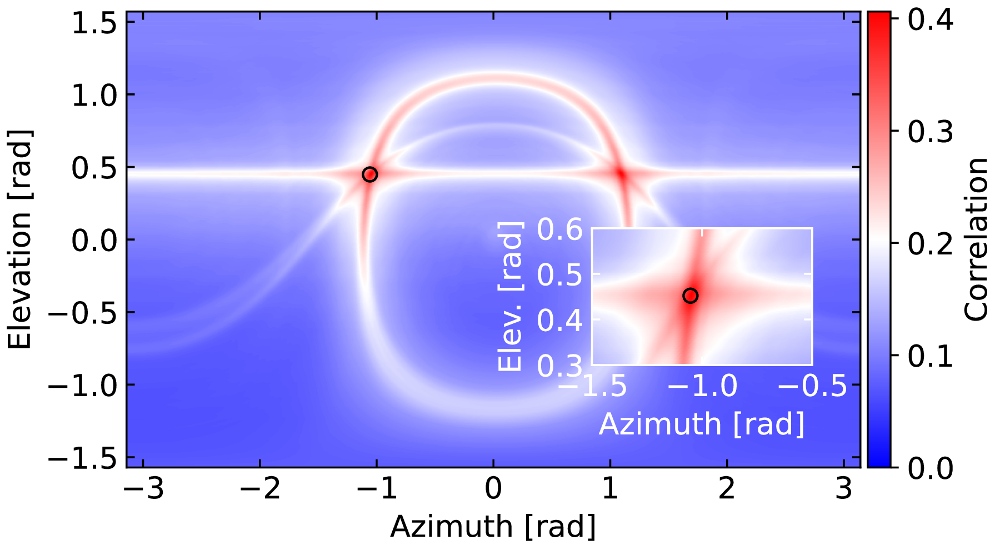

# Interferometric event reconstruction with scalar-eikonal solutions

## Installation

This software requires at least Python 3.11!

```
python -m venv env
source env/bin/activate
python -m pip install -r requirements.txt
```

## Example reconstructions

<p align="center">
  
  
</p>