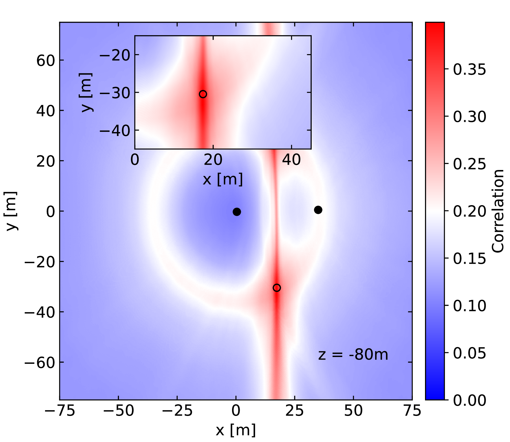
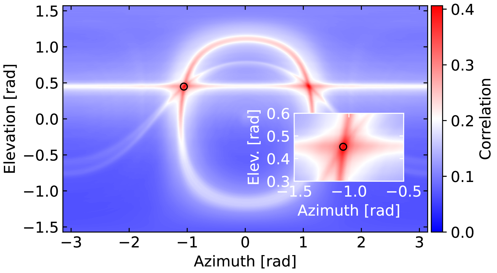

# Interferometric event reconstruction with scalar-eikonal solutions

## Installation

This software requires at least Python 3.11!

```
python -m venv env
source env/bin/activate
cd path/to/reconal
pip install .
```
The above will install the [forked version](https://github.com/mcb28/pykonal) of `pykonal` (required for generating accurate refracted maps).

## Example reconstructions

<p align="center">
  
  
</p>